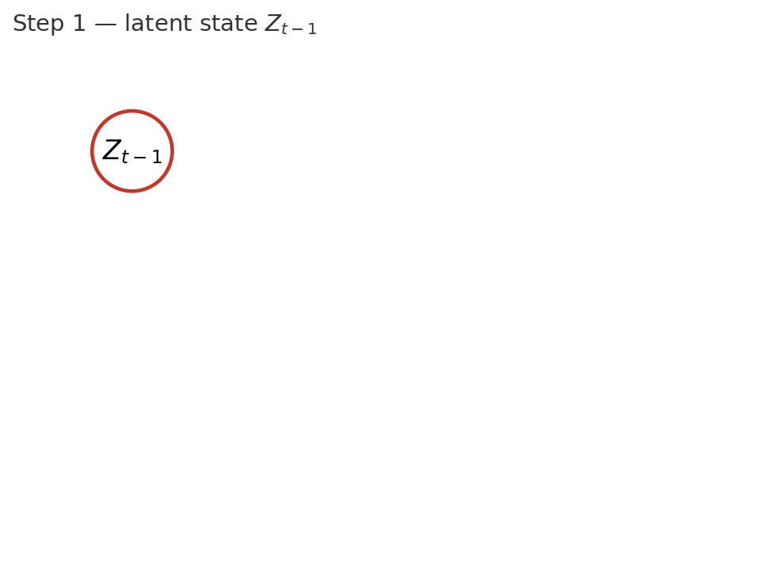
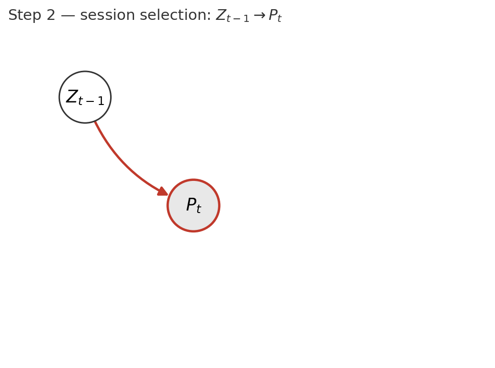
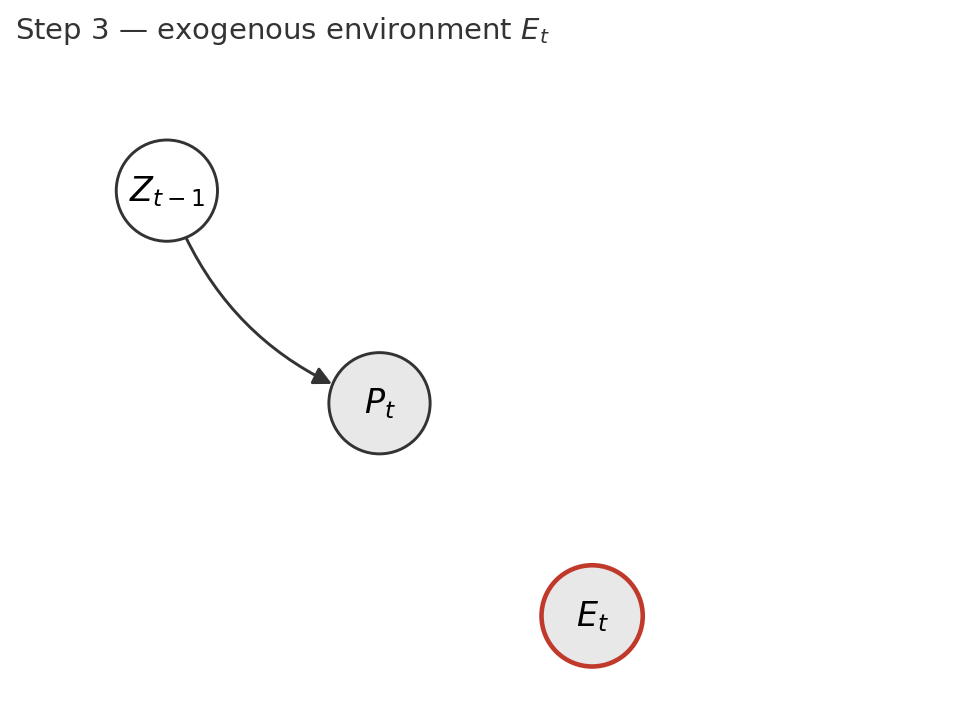
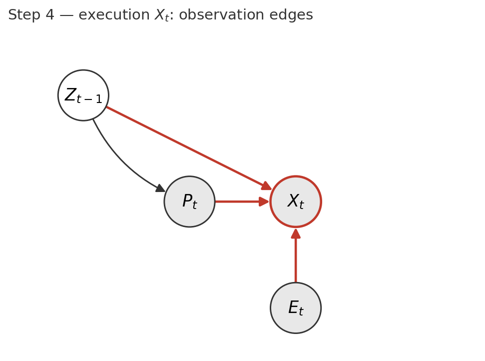
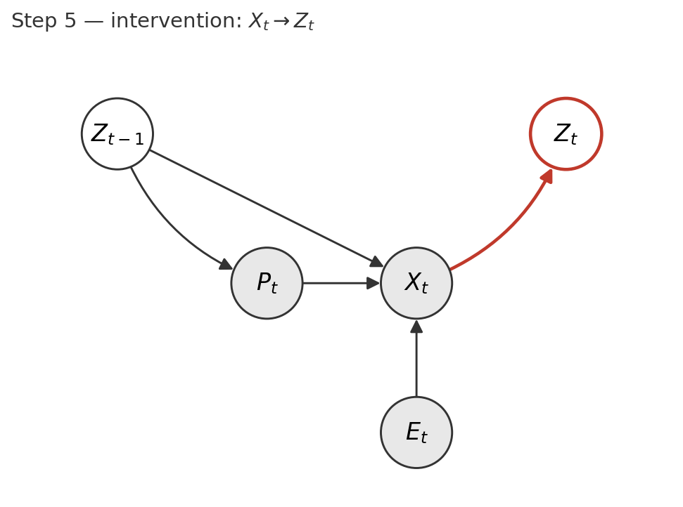
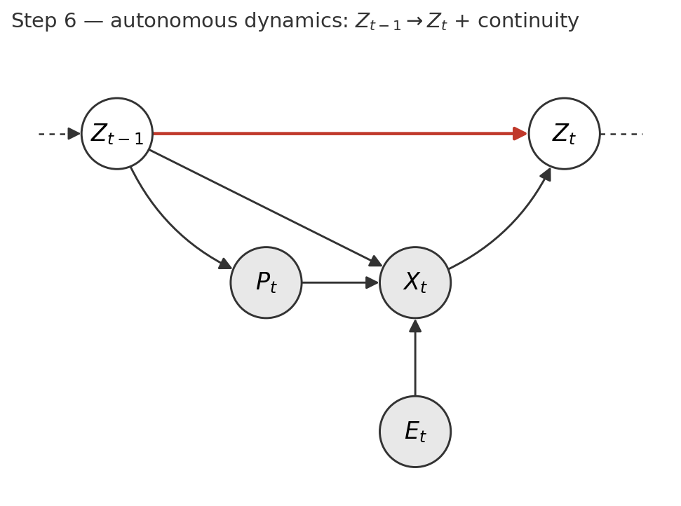

# DAG Build-Up: Workout-Day Generative Model

Companion narration for the figure sequence rendered by `scripts/make_dag_buildup.py`
(`figures/dag_buildup/step{1..6}.png`). Walks the DAG from §2 of
`theoretical_framework.md` in causal-story order. Each step adds one node or
one edge and states (i) what the node can carry, or (ii) what the edge buys
and what it costs to assume.

Convention: shaded = observed, unshaded = latent. The newly added node or
edge in each step is highlighted in red.

---

## Step 1 — Latent state `Z_{t-1}`

**What the node is.** A latent, vector-valued cardiorespiratory state on day
`t-1`. High-dimensional, multi-timescale by construction. No interpretation
is forced on individual axes — the DAG does not commit to "fitness vs
fatigue" as separable dimensions.

**What `Z` can represent (load it carries — see §8):**

- *Current fitness* (weeks)
- *Acute fatigue* (days)
- *Stable individual traits*: body mass, running economy, genetic ceiling
  (essentially constant)
- *Aging drift* (years)
- *Periodization regime*: base / build / peak / taper (weeks–months)
- *Injury-recovery biomechanical shifts* (weeks–months)
- *Environmental adaptation*: heat acclimatization, altitude, terrain-specific
  economy (weeks–months)
- *Health state*, exposed as a projection `h(Z_t)` rather than its own node
- *Residual variance* from non-workout drivers

**Cost of this design choice.** Everything not explicitly modeled elsewhere
must be representable as a smooth trajectory of `Z`. Discrete regime shifts
(injury onset, illness) require non-smooth motion in `Z` and are the most
fragile case (A10).

---

## Step 2 — Selection: `Z_{t-1} → P_t`

**New node — `P_t` (session shape, observed).** What the athlete *committed
to do* on day `t`: the structural frame of the workout. Per-family
assignments vary; typical channels:

- Distance, prescribed pace targets, terrain, route
- Session type (easy, tempo, intervals, long run)
- Time-of-day choice (when it's a planning decision, not weather-driven)

`P_t` is the *frame*; what actually happens inside it is `X_t` (next step).

**New edge — `Z_{t-1} → P_t`.** Athletes pick their session conditional on
how their body feels. State drives selection.

**What this edge buys.**

- A causal mechanism for athlete-driven non-randomness in the workout
  schedule. Without it, `P_t` would be a free input we'd have to treat as
  exogenous — which is empirically wrong.
- The basis for *mediation analysis*: `P_t` is now an observed mediator of
  `Z_{t-1}`'s effect on `X_t`. Conditioning on `P_t` recovers the **direct**
  capacity effect; not conditioning gives the **total** effect.

**What this edge costs.**

- `P_t` is no longer independent of `Z_{t-1}`. Naive comparisons across
  sessions are confounded by selection. Correct estimation of the
  observation model requires either conditioning on `P_t` or modeling
  selection explicitly.
- A *selection model* `p(P_t | Z_{t-1})` becomes part of the framework. It
  is not strictly required for state estimation but is required for any
  causal/counterfactual fitness statement (§3).
- Misassignment of signals between `P_t` and `X_t` (A1) contaminates the
  direct/mediated decomposition.

---

## Step 3 — Exogenous environment `E_t`

**New node — `E_t` (observed, exogenous).** Genuinely exogenous environmental
conditions on day `t`:

- Ambient weather (wet-bulb temperature, humidity, wind)
- Time-of-day *availability* (when it isn't itself a selection decision)

Anything *selected for its interaction with state* belongs to `P_t`, not
`E_t`. Route and terrain are in `P_t` because the athlete chose them; weather
is in `E_t` because they didn't.

**No edges yet.** The next step adds `E_t → X_t`.

**What we are committing to by labelling something "in `E`".** That it
satisfies `E_t ⊥ Z_{t-1}` and `E_t ⊥ P_t` (A2). Two consequences:

- Observation-model coefficients on `E_t` are interpretable without backdoor
  adjustment. Projection-to-reference deconfounding (sea level, flat, 5k,
  noon, 12°C) is identified.
- If a channel is mis-labelled as exogenous when it's actually selected
  (e.g. an athlete who systematically trains in cooler conditions when more
  fatigued), `E` coefficients carry confounding and prediction degrades
  under covariate shift.

---

## Step 4 — Execution `X_t`: observation edges

**New node — `X_t` (observed).** Execution: what the body actually produced
during the workout. Performance-bearing signals:

- Achieved speed, heart rate, HR drift / cardiac cost, pacing variability
- Within-session dynamics aggregated to a daily summary (A6)
- On rest days `X_t` is absent (handled in step 6)

**New edges — three parents of `X_t`:**

1. `Z_{t-1} → X_t` — capacity generates the performance observation
2. `P_t → X_t` — session shape constrains execution
3. `E_t → X_t` — acute environment modulates execution

Together these form the **observation model** `p(X_t | Z_{t-1}, P_t, E_t)` —
the conditional that drives the prediction head and identifies the
direct-capacity effect.

**What these edges buy.**

- An identifiable observation model. Variation in `(P_t, E_t)` at matched
  `Z_{t-1}` is the source of identification for the `Z_{t-1} → X_t` edge.
- A clean separation between the *plan* and the *realization*: how much of
  `X_t`'s variation comes from "what the athlete tried to do" vs "what they
  could do today" vs "the weather".
- A target for prediction: `p(X_{t+τ} | …)` factors through the observation
  model evaluated at known `(P_{t+τ}, E_{t+τ})`.

**What these edges cost.**

- `Z_{t-1} ⊥ X_t | P_t, E_t` does **not** hold (it's the very edge we want
  to estimate). Anything that claims this independence is misspecified.
- The observation model must be expressive enough to absorb how `Z`'s many
  dimensions show up in `X_t`. A too-small `d` for `Z` aliases unmodeled
  state into the observation residual.
- `P_t` and `X_t` together are enough to compress workouts into a *load
  proxy* (TRIMP, TSS, ACWR) — but those scalars are *summaries of `(P,
  X)`*, not measurements of `Z` (§11). The framework refuses to treat
  ACWR/load as a state regressor.

---

## Step 5 — Intervention: `X_t → Z_t`

**New node — `Z_t` (latent).** State on the next day. Same primitives as
`Z_{t-1}` (Step 1), but now we commit to it being downstream of today's
execution.

**New edge — `X_t → Z_t`.** The workout *is* a training stimulus. The
observation is also the intervention.

**Why this is the framework's most distinctive structural claim.** In a
standard HMM/Kalman setup, observations are caused by the latent state and
have no causal effect on it. Here the observation pushes the state.
Concretely:

- Filtering for `p(Z_t | …)` requires *two coupled steps per workout day*:
  emit `X_t` from `(Z_{t-1}, P_t, E_t)`, then transition `Z_{t-1} → Z_t`
  via `X_t`.
- *No counterfactual state trajectory without counterfactual workouts.*
  Fitter-yesterday produces a different `X_t` (both directly and via
  selection of `P_t`), which produces a different `Z_t`. `Z_{t-1}` and `X_t`
  are not independently manipulable for the `Z_t` transition.
- *Identifiability requires temporal variation in `X_t`*. Constant workouts
  make this edge unobservable. Variation in `P_t` (driven partly by
  `Z_{t-1}`, partly by exogenous scheduling) is a principal source.
- *Training load emerges, not assumed*: any scalar load is a lossy
  projection of the full `X_t`.

**What this edge costs.**

- We commit (A3) to *no direct* `P_t → Z_t` and *no direct* `E_t → Z_t`.
  The plan that wasn't executed has no training effect; a hot day with the
  same execution as a cool day produces (to first order) the same stimulus.
  Chronic environmental adaptation must therefore be *absorbed into `Z`'s
  slow-moving dimensions* — there is no `E → Z` edge to carry it.
- We commit (A9) to *no `U_t` node* for sleep, nutrition, illness, stress.
  These appear as transition noise; correlation between any of them and
  `X_t` biases the estimated `X → Z` effect.
- The `f` function `p(Z_t | Z_{t-1}, X_t)` carries the workout-day dynamics.
  It is per-family and identifiable only on workout days.

---

## Step 6 — Autonomous dynamics: `Z_{t-1} → Z_t` + continuity

**New edge — `Z_{t-1} → Z_t`.** State carries forward independently of any
workout. On rest days this is the *only* edge into `Z_t`: the day-step
collapses to `p(Z_t | Z_{t-1}) = g(Z_{t-1}) + noise`.

**Continuity stubs.** The dashed arrows leftward into `Z_{t-1}` and
rightward out of `Z_t` indicate the framework is one slice of an ongoing
trajectory, not a closed system.

**What this edge buys.**

- *Two transition regimes* (A5):
  - Workout day: `f(Z_{t-1}, X_t)` — workout-driven dynamics.
  - Rest day: `g(Z_{t-1})` — autonomous recovery, decay, circadian/seasonal
    drift.
- A *Markov barrier* at `Z_t` (A4): given `Z_t`, past observations add no
  predictive power for future observations beyond what `Z_t` and future
  `(P, E)` provide.
- The structural skeleton needed for **prediction**: state forward via `f`
  on workout days and `g` on rest days, then observation at reference
  `(P, E)`.

**What this edge costs.**

- `g` is *bounded*. The framework only claims `g` is valid for up to 10
  consecutive rest days; past that, the athlete enters detraining and `Z_t`
  is undefined (re-entry uses the last valid `Z_t` with degraded
  confidence). 10 days is calibrated to the onset of measurable detraining
  in trained athletes (VO2max decline, mitochondrial/capillary regression).
- `f`, `g`, and the observation model are *not jointly identified at
  framework level*. Identification comes from per-family restrictions:
  workout-only data constrains `f`, rest-only data constrains `g`,
  variation in `(P, E)` at matched `Z_{t-1}` constrains the observation
  model.
- *Stationarity* of `f`, `g`, observation, and selection (A10): all
  parameters are constant per athlete across the observation window. Any
  non-stationarity must show up as `Z`-trajectory motion, not parameter
  drift. This is the assumption most likely to fail under regime change
  (injury, equipment change, coaching change).

---

## Reading the full DAG

The four conditional distributions that carry all the modeling content:

1. **Selection** `p(P_t | Z_{t-1})` — needed for causal/counterfactual
   statements; not strictly required for state estimation.
2. **Observation** `p(X_t | Z_{t-1}, P_t, E_t)` — drives the prediction head
   and the deconfounding pipeline.
3. **Workout-day transition** `f(Z_{t-1}, X_t) + noise`.
4. **Rest-day transition** `g(Z_{t-1}) + noise`, valid up to 10 days.

Prediction decomposes as state-forward (via `f` and `g`) followed by
observation at reference conditions `(P_{t+τ}, E_{t+τ})`. The framework
refuses to read state off load proxies; it refuses to put chronic
environment or session shape on `Z` directly; it accepts that `Z` is doing a
lot of work and that the model family must be expressive enough to carry it.
