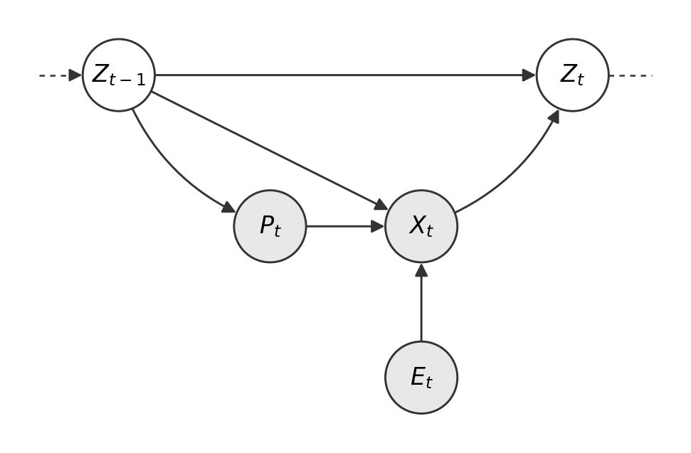

# Theoretical Framework: Latent Cardiorespiratory State from Workout Observations

## 1. Primitives

| Symbol | Type | Role | Observability |
|---|---|---|---|
| `Z_t` | latent, vector | Cardiorespiratory state on day `t`. High-dimensional, multi-timescale. Carries current fitness, acute fatigue, stable individual traits, aging drift, periodization regime, post-injury biomechanical shifts, environmental adaptation, and all other non-stationarity. Dimensionality is a per-family modeling choice. | Unobserved |
| `P_t` | observed | Session shape: what the athlete committed to do on day `t`. Captures the structural characteristics of the workout (distance, terrain, route, session type) that frame how `X_t` is produced. State-dependent: athletes select session shapes in response to `Z_{t-1}`. | Observed |
| `X_t` | observed | Execution: what actually happened during the workout (performance-bearing signals). On rest days `X_t` is absent (A5). | Observed |
| `E_t` | exogenous | Genuinely exogenous environmental conditions on day `t` (weather, time-of-day). `E_t ⊥ Z_{t-1}`, `E_t ⊥ P_t`. | Observed |

Time index `t` is daily.

The separation between `P_t` and `X_t` is the framework's central observable-side modeling choice. `P_t` is the frame (what the athlete set out to do); `X_t` is the realization within that frame (what the body produced). Concrete per-family assignments of signals to `P_t` vs `X_t` are deferred (appendix / implementation doc).

---

## 2. The DAG

\

Shaded = observed, unshaded = latent. Incoming and outgoing dashed stubs on `Z_{t-1}` and `Z_t` indicate continuity: the framework is a single time-slice of an ongoing state trajectory.

Edges:

1. `Z_{t-1} → P_t` — the athlete's prior state influences session selection.
2. `Z_{t-1} → X_t` — capacity generates the performance observation.
3. `P_t → X_t` — the session shape constrains the execution.
4. `E_t → X_t` — exogenous environment modulates execution.
5. `X_t → Z_t` — the workout is a training stimulus. `X_t` is both measurement AND intervention.
6. `Z_{t-1} → Z_t` — autonomous state dynamics.

No direct `E_t → Z_t` or `P_t → Z_t` edge: acute environmental and session-shape effects reach `Z_t` only through `X_t`. Chronic environmental adaptation and training-regime effects are absorbed into `Z`'s slow-moving dimensions.

On rest days, `P_t` and `X_t` are absent and the day-step collapses to `Z_{t-1} → Z_t`.

**Two transition regimes (A5):**
- Workout day: `p(Z_t | Z_{t-1}, X_t) = f(Z_{t-1}, X_t)` + noise.
- Rest day: `p(Z_t | Z_{t-1}) = g(Z_{t-1})` + noise, valid for consecutive rest periods up to 10 days.
- Past 10 consecutive rest days: `Z_t` is undefined; the athlete exits the state-tracked regime (inactivity).
- Re-entry after a gap >10 days uses the last valid `Z_t` before the gap as the starting point, with degraded confidence relative to a freshly observed state.

`f` and `g` are distinct functional forms with distinct parameters. `g` carries the autonomous dynamics on rest days: recovery, short-term decay, circadian/seasonal drift. The 10-day bound scopes `g` to the range where rest-day data supports estimation and where physiology is still in the recovery regime rather than the detraining regime.

---

## 3. Factorization

Over a single day-step:

**Workout day:**
```
p(Z_{t-1}, P_t, E_t, X_t, Z_t)
  = p(Z_{t-1}) · p(P_t | Z_{t-1}) · p(E_t)
    · p(X_t | Z_{t-1}, P_t, E_t) · p(Z_t | Z_{t-1}, X_t)
```

**Rest day:**
```
p(Z_{t-1}, Z_t) = p(Z_{t-1}) · p(Z_t | Z_{t-1})
```

Four conditional distributions carry the modeling content:

- **Selection model**: `p(P_t | Z_{t-1})`. How state shapes session choice.
- **Observation model**: `p(X_t | Z_{t-1}, P_t, E_t)`. Drives the prediction head.
- **Workout-day transition**: `p(Z_t | Z_{t-1}, X_t)` (function `f`).
- **Rest-day transition**: `p(Z_t | Z_{t-1})` (function `g`), valid for rest periods up to 10 days (A5).

The selection model `p(P_t | Z_{t-1})` is not strictly required to estimate `Z_t` from observed `(P_t, X_t, E_t)`. It is required for causal statements about fitness: `P_t` is a mediator of `Z_{t-1}`'s effect on `X_t`, and conditioning on `P_t` isolates the direct capacity effect from the indirect session-selection effect (§5).

---

## 4. The Dual Role of X_t

The `X_t → Z_t` arrow distinguishes this framework from a conventional hidden-state model. In a standard HMM or Kalman setting, observations are caused by the latent state and have no causal effect on it. Here, the observation *is* the intervention: running the workout trains the athlete.

(a) **Information flow is non-standard.** `Z_{t-1}` produces `P_t`; `Z_{t-1}` and `P_t` and `E_t` jointly produce `X_t`; then `X_t` pushes `Z_{t-1}` to `Z_t`. Filtering targets `p(Z_t | X_{1:t}, P_{1:t}, E_{1:t})`, with posterior propagation in two coupled steps per workout day.

(b) **No counterfactual state trajectory without counterfactual workouts.** Fitter-yesterday generates a different `X_t` (both because of direct `Z_{t-1} → X_t` and because of selection-driven `P_t`), which generates a different `Z_t`. `Z_{t-1}` and `X_t` are not independently manipulable on the `Z_t` transition.

(c) **Training load emerges, not assumed.** Load proxies (TRIMP, TSS, ACWR) are compressions of `X_t` (or of `(P_t, X_t)` jointly). The full execution is the stimulus; any scalar load is a lossy projection.

(d) **Identifiability requires temporal variation in `X_t`.** Constant workouts make the `X_t → Z_t` edge unobservable. Variation in `P_t` (driven partly by `Z_{t-1}`, partly by exogenous scheduling) is a principal source of variation in `X_t`.

(e) **`P_t` is a mediator of the `Z_{t-1} → X_t` effect.** Two ways state shapes execution: directly (the body's capacity at that instant) and indirectly (the session the athlete selected given their state). The observation model `p(X_t | Z_{t-1}, P_t, E_t)` estimates the direct effect; the selection model `p(P_t | Z_{t-1})` carries the indirect one. Whether the total or direct effect is the right target depends on the downstream question (see §5).

---

## 5. Conditional Independencies

| Query | Holds? | Why |
|---|---|---|
| `X_t ⊥ X_{t+1} \| Z_t, P_{t+1}, E_{t+1}` | Yes | `X_{t+1}` depends on `Z_t, P_{t+1}, E_{t+1}`; Markov on `Z`. |
| `E_t ⊥ Z_{t-1}` | Yes | Exogeneity. |
| `P_t ⊥ Z_{t-1}` | **No** | Selection edge `Z_{t-1} → P_t`. |
| `E_t ⊥ P_t` | Yes | No edge. |
| `E_t ⊥ Z_t \| X_t, Z_{t-1}` | Yes | `E_t` affects `Z_t` only via `X_t` (A3). Chronic environmental adaptation is absorbed into `Z`'s slow dimensions (§8), not carried by an `E → Z` edge. |
| `P_t ⊥ Z_t \| X_t, Z_{t-1}` | Yes | Symmetric to above: `P_t` reaches `Z_t` only through `X_t`. |
| `Z_{t-1} ⊥ X_{t+1} \| Z_t, P_{t+1}, E_{t+1}` | Yes | Markov property on `Z`. |
| `Z_{t-1} ⊥ X_t \| P_t, E_t` | **No** | Direct edge `Z_{t-1} → X_t`. This is the edge the observation model estimates. |

All entries hold under the Markov and stationarity assumptions (A4, A10) and the no-direct-`E→Z`, no-direct-`P→Z` structural claims (A3).

**Key practical implication**: `Z_t` is a Markov barrier. Given `Z_t`, past observations add no predictive power for future observations beyond what `Z_t` and future `(P, E)` provide.

**Mediator note**: `P_t` is a mediator, not a confounder, of the `Z_{t-1} → X_t` relationship. Conditioning on `P_t` recovers the **direct** effect of state on execution (`Z_{t-1} → X_t` net of session-selection); leaving `P_t` un-conditioned gives the **total** effect (direct plus `P_t`-mediated). Which quantity is the right target depends on the downstream question. For prediction given a known session `P_{t+τ}`, condition on `P`. For counterfactual fitness ("how would this athlete perform if we fixed the session?") the direct effect is the target. `E_t` is exogenous and need not be conditioned for identification, though it improves precision.

---

## 6. The Inference Problem

Given observed `(P_{1:T}, X_{1:T}, E_{1:T})`, recover the latent trajectory `Z_{0:T}`.

| Target | Object | Use |
|---|---|---|
| Filtering | `p(Z_t \| P_{1:t}, X_{1:t}, E_{1:t})` | online readiness |
| Smoothing | `p(Z_t \| P_{1:T}, X_{1:T}, E_{1:T})` | historical reconstruction |
| Prediction | `p(X_{t+τ} \| P_{1:t+τ}, X_{1:t}, E_{1:t+τ})` | next-session performance |

All three require the observation model, `f`, and `g`.

**Prior on `Z_0` (A8)**: diffuse. A 6-month warm-up discards state estimates from the window where the prior still dominates.

**Joint identifiability**: `f`, `g`, and the observation model are not jointly identified at framework level. Identification relies on per-family restrictions: functional-form assumptions, pooling strategies, sub-sample structure (workout-only data constrains `f`, rest-only data constrains `g`; variation in `P_t` and `E_t` at matched `Z_{t-1}` identifies the observation model).

---

## 7. The Prediction Task

Given conditions of the next workout (`P_{t+τ}`, `E_{t+τ}`, and a chosen subset of `X_{t+τ}`), predict the unobserved component of `X_{t+τ}`.

```
p(X_{t+τ} | P_{1:t+τ}, X_{1:t}, E_{1:t+τ})
  = ∫ p(X_{t+τ} | Z_{t+τ-1}, P_{t+τ}, E_{t+τ})
      · p(Z_{t+τ-1} | P_{1:t}, X_{1:t}, E_{1:t}) dZ_{t+τ-1}
```

Two factors:
- `p(Z_{t+τ-1} | P_{1:t}, X_{1:t}, E_{1:t})` — τ-step state predictive. State evolves via `f` on workout days and `g` on rest days (within the 10-day bound, A5).
- `p(X_{t+τ} | Z_{t+τ-1}, P_{t+τ}, E_{t+τ})` — observation model at the queried conditions.

The DAG justifies the two-step decomposition: predict state forward, then project state through the observation model under known `P` and `E`. Deconfounding belongs on the observation model; `P_t` and acute `E_t` enter there. Chronic environmental adaptation and regime effects are already inside `Z`.

---

## 8. What `Z` Carries

All non-stationarity lives inside `Z`. This is a deliberate design bet: `Z` is doing a lot of work.

| Load | Source assumption | Timescale |
|---|---|---|
| Current fitness | A4 | weeks |
| Acute fatigue | A4, A5 | days |
| Stable individual traits (body mass, economy, genetic ceiling) | A7 | essentially constant |
| Aging drift | A10 | years |
| Periodization regime (base/build/peak/taper) | A10 | weeks to months |
| Injury-recovery biomechanical shifts | A10 | weeks to months |
| Environmental adaptation (heat acclimatization, altitude, terrain-specific economy) | A3 | weeks to months |
| Health state (as a projection `h(Z_t)`) | A9 | variable |
| Residual variance from non-workout drivers | A9 | variable |

**Implications:**
- `Z` is necessarily high-dimensional.
- `Z` is necessarily *multi-timescale*: some dimensions essentially constant, some year-scale, some week-scale, some day-scale.
- Absorption of non-stationarity into `Z` is conditional on the per-family observation and transition functions being expressive enough to map `Z`'s internal variation onto the observed non-stationarity. High-dim `Z` is necessary, not sufficient.
- The framework is fragile to phenomena whose timescale cannot be expressed smoothly as a dimension of `Z`. Discrete regime shifts (injury onset, illness) require `Z` dimensions that change non-smoothly.

This section is accounting, not an additional assumption.

---

## 9. Assumption Ledger

### A1. Observation splits into session shape `P_t` and execution `X_t`; both observed
- **Claim**: The observable side of a workout factors into `P_t` (what the athlete set out to do) and `X_t` (what the body produced during execution). Both are observed.
- **Consequence**: `P_t` is an observed mediator of `Z_{t-1}`'s effect on `X_t`. Conditioning on `P_t` cleanly separates the direct `Z_{t-1} → X_t` effect from the `Z_{t-1} → P_t → X_t` mediated effect.
- **Accepted cost**: the split of concrete signals between `P_t` and `X_t` is a per-family assignment; ambiguous channels must be adjudicated by the family's observation model. Misassignment (treating an execution signal as part of `P_t` or vice versa) contaminates the direct/indirect decomposition.
- **Relied on in**: §2 edges; §4 duality (e); §5 mediator note; §7 prediction conditioning.

### A2. `E_t` is exogenous
- **Claim**: `E_t` is genuinely exogenous: `E_t ⊥ Z_{t-1}` and `E_t ⊥ P_t`.
- **Scope**: `E_t` covers conditions not selected for their interaction with `Z_{t-1}` (e.g., ambient weather, time-of-day availability). Route and terrain, which *are* selected, belong to `P_t`, not `E_t`.
- **Consequence**: observation coefficients on `E_t` are interpretable without backdoor adjustment; projection-to-reference deconfounding is clean.
- **Relied on in**: §2 edges; §3 factorization; §5 independencies; §7 prediction.

### A3. `P_t` and `E_t` affect `Z_t` only indirectly, via `X_t`
- **Claim**: no direct `P_t → Z_t` or `E_t → Z_t` edge.
- **Rationale**: the adaptive stimulus is the execution, not the plan or the weather. A planned but unexecuted workout has no training effect; a hot day with a matched execution has the same stimulus as a cool day with the same execution (up to second-order effects that would require a richer `X_t`).
- **Chronic adaptation**: absorbed into `Z_t`'s slow-moving dimensions. Consistent with A10 and §8.
- **Consequence**: the framework imposes no explicit mechanism for environmental adaptation or periodization-regime effects; they must emerge from `Z`-trajectory variation under a sufficiently expressive model family.
- **Relied on in**: §2 edges; §3 factorization; §8 `Z` load.

### A4. `Z` is Markov and high-dimensional; dimension is a per-family choice
- **Claim**: `p(Z_t | Z_{t-1}, X_t)` (workout) or `p(Z_t | Z_{t-1})` (rest) — no `Z_{t-k}` for `k > 1`, no `X_{t-k}`.
- **High-dim is load-bearing**: Markov compression is only faithful when `Z` carries enough internal dimensions to encode what the past would otherwise provide.
- **Dimension is family-specific**: the DAG commits to `Z ∈ ℝ^d`, `d ≥ 1`. Each model family picks `d`.
- **Relied on in**: §2 edges; §5 Markov barrier; §8 `Z` load accounting.

### A5. Two transition regimes, with bounded `g`
- **Claim**: workout day and rest day have distinct transitions (`f`, `g`).
- **`g` carries**: recovery, short-term decay, circadian/seasonal drift.
- **Validity bound**: 10 consecutive rest days. Within the bound, `g` models recovery dynamics. Beyond, the athlete is in inactivity and `Z_t` is undefined.
- **Rationale for 10 days**: detraining (VO2max decline, mitochondrial and capillary regression) becomes measurable around 10–14 days in trained athletes. Bounding at 10 days keeps `g` scoped to recovery.
- **Re-entry after inactivity**: last valid `Z_t` is the starting point, with degraded confidence. Mechanism for representing degradation is per-family.
- **Identifiability**: `g` estimable only on rest days, `f` only on workout days; joint identification relies on input signatures and per-family restrictions.
- **Relied on in**: §2 two regimes and bound; §3 factorization; §7 prediction.

### A6. Daily granularity; within-day structure collapsed
- **Claim**: index `t` is daily; multiple workouts in one day fuse into a single `(P_t, X_t)` pair by aggregation.
- **Aggregation scheme is a modeling choice**, not a framework commitment.
- **Lost**: within-day ordering, doubles-vs-singles distinction, morning/evening effects (unless captured as channels of `P_t` or `X_t`).
- **Relied on in**: §1 time index.

### A7. Per-athlete DAG; between-athlete differences live in `Z`
- **Claim**: The DAG's functional forms (`f`, `g`, observation, selection) are universal across athletes. Between-athlete variation is absorbed into `Z` — its initial condition, its trajectory, its stable-trait dimensions.
- **Consequence**: two athletes with the same `Z_t`, `P_t`, and `E_t` produce the same distribution over `X_t`. Responder-type heterogeneity must be a `Z`-trajectory difference, not a function-parameter difference.
- **Relied on in**: §1 primitives; §8 `Z` load.

### A8. `Z_0` has a diffuse prior; 6-month warm-up
- **Claim**: no informative prior on `Z_0`. First 6 months per athlete discarded as prior-contaminated.
- **Relied on in**: §6 inference.

### A9. No non-workout input node; health state is a projection
- **Claim**: `Z_t` is driven only by `Z_{t-1}` and `X_t` (workout day), or `Z_{t-1}` alone (rest day). No `U_t` for sleep, nutrition, strength, illness, stress.
- **Accepted cost**: unmodeled drivers appear as transition noise; any correlation with `X_t` biases the estimated `X → Z` effect.
- **Health state**: a projection `h(Z_t)`, not a separate node.
- **Relied on in**: §2 (by omission); §8 `Z` load.

### A10. Stationarity of `f`, `g`, observation, and selection models; `Z` absorbs all non-stationarity
- **Claim**: `f`, `g`, `p(X | Z, P, E)`, and `p(P | Z)` have *constant parameters* across the observation window per athlete.
- **Absorbed into `Z`'s trajectory**: aging drift, periodization regimes, post-injury biomechanical shifts, evolving selection behavior.
- **Conditional on family expressiveness**: see §8 implications.
- **Relied on in**: §6 inference; §7 prediction; §8 `Z` load.

### Quick-scan failure-mode table

| Assumption | If violated, what breaks |
|---|---|
| A1 | Mis-split signals contaminate the direct/mediated decomposition of `Z_{t-1} → X_t` |
| A2 | `E` coefficients and projection carry confounding; prediction degrades under covariate shift in the non-exogenous channel |
| A3 | Chronic environmental or regime effects not representable within `Z`'s expressible trajectory |
| A4 | Markov property fails → past observations carry info beyond `Z_t` |
| A5 | Single-regime transition misfits rest-day dynamics; `g` forced past 10 days misfits detraining |
| A6 | Within-day dynamics invisible; doubles mis-scored |
| A7 | Responder-type differences appear as noise; pooling mis-specified |
| A8 | Shorter warm-up leaks prior bias into scored predictions |
| A9 | Sleep/stress/illness as transition noise; bias if correlated with `X` |
| A10 | `Z` trajectory absorbs non-stationarity it cannot represent smoothly; discrete shifts appear as implausible state jumps |

---

## 10. Hyperparameters vs Architectural Biases

| Assumption | Tunable (hyperparameter) | Baked-in (architectural) |
|---|---|---|
| A1 | Per-family assignment of signals to `P_t` vs `X_t`; functional form of `p(P \| Z)` | `P_t` and `X_t` both observed; both are parents of `X_t`'s execution-side conditional |
| A2 | Which channels are treated as `E_t` | `E_t` exogenous; no `E_t → Z_t` edge |
| A3 | Which `Z` dimensions absorb chronic adaptation; timescales of slow `Z` components | No direct `P_t → Z_t` or `E_t → Z_t` edge |
| A4 | Dimension `d` of `Z`; per-family parameterization | Markov property (first-order); latent state exists |
| A5 | Functional forms of `f` and `g`; whether they share parameters | Two distinct regimes; `g` bounded at 10 days; past-bound `Z_t` undefined; re-entry uses last valid `Z_t` with degraded confidence |
| A6 | Aggregation scheme for multi-workout days | Daily time index |
| A7 | Pooling strategy across athletes; which `Z` dimensions are shared | Universal functional forms; between-athlete variation lives in `Z` |
| A8 | Warm-up length; prior variance on `Z_0` | Diffuse prior; no informative population prior |
| A9 | Which health-state projections `h(Z_t)` are exposed | Absence of `U_t` node |
| A10 | Regularization on parameter stability (if any) | Stationarity of `f`, `g`, observation, selection |

- *Right column* is the framework. Changing it means changing the DAG.
- *Left column* is what experimental runners sweep.

---

## 11. What This Framework Does **Not** Claim

- That `Z_t` is interpretable as any single physiological quantity. `Z_t` is abstract and multi-dimensional; physiological interpretability of any axis is a property of the model family, not the DAG.
- That fitness and fatigue are separable by construction. They may emerge as components of `Z` under specific families, but the DAG does not enforce it.
- That training-load scalars (TSS, ACWR) represent state. They are summaries of `X_t` (or of `(P_t, X_t)` jointly), not of `Z_t`.
- That injury, illness, and behavioral regime changes are explicitly modeled. They are absorbed into `Z` under A10, with the fragility noted in §8.
- That the `P_t`/`X_t` split is unique. The framework requires *a* split that cleanly separates session-shape from execution; it does not prescribe one.

---

## Slide-level takeaways

1. **Four conditional distributions carry all the content**: selection `p(P | Z)`, observation `p(X | Z, P, E)`, workout transition `f(Z, X)`, rest transition `g(Z)`.
2. **`X_t` is observation AND intervention** — the non-standard feature. `P_t` is an observed mediator that separates direct capacity from session-selection effects.
3. **`E_t` is exogenous**; acute effects reach `Z_t` only via `X_t`; chronic adaptation is absorbed into `Z`.
4. **`Z` is high-dimensional and multi-timescale** because it absorbs everything the framework does not model separately.
5. **Two regimes, bounded `g`**: workout and rest transitions are distinct; rest transition is valid up to 10 days, past which `Z` is undefined.
6. **Prediction = state-forward-project + observation-at-reference-conditions**, where reference conditions span `(P, E)` at the queried session.
